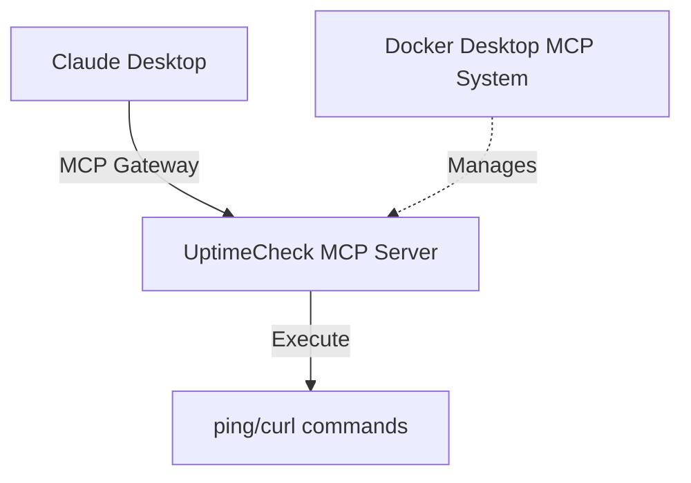

# UptimeCheck MCP Server - Setup Guide
A Model Context Protocol (MCP) server that provides network uptime checking tools for Claude Desktop.

## Table of Contents
- [Prerequisites Installation](#prerequisites-installation)
  - [1. Install Docker Desktop](#1-install-docker-desktop)
    - [Windows](#windows)
    - [macOS](#macos)
    - [Linux](#linux)
  - [2. Install Docker MCP Plugin](#2-install-docker-mcp-plugin)
  - [3. Install Claude Desktop](#3-install-claude-desktop)
    - [Windows](#windows-1)
    - [macOS](#macos-1)
- [MCP Server Setup](#mcp-server-setup)
  - [1. Clone and Build](#1-clone-and-build)
  - [2. Configure Claude Desktop](#2-configure-claude-desktop)
  - [3. Test the Server](#3-test-the-server)
- [Available Tools](#available-tools)
  - [ping_host](#ping_host)
  - [check_website](#check_website)
- [Usage Examples](#usage-examples)
- [Troubleshooting](#troubleshooting)
- [Development](#development)
- [Contributing](#contributing)
- [License](#license)
- [Acknowledgements](#acknowledgements)

# Prerequisites Installation
## 1. Install Docker Desktop
### Windows
- Download Docker Desktop from docker.com/products/docker-desktop
- Run the installer and follow setup wizard
- Enable WSL 2 integration if prompted
- Restart your computer after installation

### macOS
- Download Docker Desktop for Mac from the official site
- Drag Docker.app to Applications folder
- Launch Docker Desktop and complete setup

### Linux
```bash
# Ubuntu/Debian
curl -fsSL https://get.docker.com -o get-docker.sh
sudo sh get-docker.sh
sudo usermod -aG docker $USER
# Log out and back in
```
## 2. Install Docker MCP Plugin
```bash
# Install the Docker MCP plugin
docker plugin install docker/mcp-plugin:latest

# Verify installation
docker mcp version
```
## 3. Install Claude Desktop
### Windows
- Download from claude.ai/download
- Run installer and complete setup

### macOS
- Download Claude Desktop for macOS
- Move to Applications folder
- Launch and sign in


# MCP Server Setup
## 1. Clone and Build
```bash
# Clone this repository
git clone <your-repo-url>
cd uptimecheck-mcp-server

# Build the Docker image
docker build -t uptimecheck-mcp-server .
```
## 2. Set Up MCP Configuration Files
Create Directory Structure
### Windows
```powershell
# Create MCP directories
mkdir $env:USERPROFILE\.docker\mcp\catalogs -Force
```
### macOS/Linux:
```bash
# Create MCP directories
mkdir -p ~/.docker/mcp/catalogs
```
### Create custom.yaml
**File Location:**
- Windows: %USERPROFILE%\.docker\mcp\catalogs\custom.yaml
- macOS: ~/.docker/mcp/catalogs/custom.yaml
- Linux: ~/.docker/mcp/catalogs/custom.yaml

**Content:**

```yaml
version: 2
name: custom
displayName: Custom MCP Servers
registry:
  uptimecheck:
    description: "Checks server and website uptime (ping, curl)"
    title: "UptimeCheck"
    type: server
    dateAdded: "2025-09-15T13:31:00Z"
    image: uptimecheck-mcp-server:latest
    ref: ""
    readme: ""
    toolsUrl: ""
    source: ""
    upstream: ""
    icon: ""
    tools:
      - name: ping_host
      - name: check_website
    secrets: []
    metadata:
      category: monitoring
      tags:
        - uptime
        - ping
        - curl
        - monitoring
        - network
      license: MIT
      owner: local
```
### Create registry.yaml
**File Location:**
- Windows: 
    - %USERPROFILE%\.docker\mcp\registry.yaml
- macOS/Linux: 
    - ~/.docker/mcp/registry.yaml

**Content:**

```yaml
registry:
  uptimecheck:
    ref: ""
```
## 3. Configure Claude Desktop
Find Claude Config File
**File Locations:**
- Windows: %APPDATA%\Claude\claude_desktop_config.json
- macOS: ~/Library/Application Support/Claude/claude_desktop_config.json
- Linux: ~/.config/Claude/claude_desktop_config.json

### Update Configuration
Replace your config file content with:

```json
{
  "mcpServers": {
    "mcp-toolkit-gateway": {
      "command": "docker",
      "args": [
        "run",
        "-i",
        "--rm",
        "-v", "/var/run/docker.sock:/var/run/docker.sock",
        "-v", "C:/Users/YOUR_USERNAME/.docker/mcp:/mcp",
        "docker/mcp-gateway",
        "--catalog=/mcp/catalogs/docker-mcp.yaml",
        "--catalog=/mcp/catalogs/custom.yaml",
        "--config=/mcp/config.yaml",
        "--registry=/mcp/registry.yaml",
        "--tools-config=/mcp/tools.yaml",
        "--transport=stdio"
      ]
    }
  }
}
```
⚠️ **Important Path Replacements:**
---
- **Windows**: Replace C:/Users/YOUR_USERNAME with your actual user path (e.g., C:/Users/johnsmith)
- **macOS**: Replace with /Users/YOUR_USERNAME
- **Linux**: Replace with /home/YOUR_USERNAME

# Launch and Verify
## 1. Restart Services

 1. Close Claude Desktop completely
 2. Restart Docker Desktop
 3. Wait 30 seconds, then launch Claude Desktop
## 2. Verify MCP Server
```bash
# Check if server is recognized
docker mcp server list

# Should show: uptimecheck
3. Initialize MCP System (if needed)
bash
# If server doesn't appear, reset and reinitialize
docker mcp catalog reset
docker mcp catalog init
docker mcp catalog ls
```
## 3. Usage Examples
Once set up, you can use these tools in Claude Desktop conversations:

### Ping Host Tool
```text
"Ping 8.8.8.8 to check if it's reachable"

"Check if my server at 192.168.1.100 is up"

"Ping google.com and tell me the results"
```
### Website Checker Tool
```text
"Check if https://google.com is up"

"Is my website https://example.com responding?"

"Test website availability for https://github.com"
```
# Troubleshooting
## "No tools available" in Claude Desktop
1. Check tool names match exactly (no backslashes in YAML)
2. Verify file paths in Claude config are correct for your OS
3. Restart both Docker Desktop and Claude Desktop after any config changes
4. Check Docker permissions - ensure Docker can access your user directory

## Server not appearing in docker mcp server list
1. Verify custom.yaml syntax with an online YAML validator
2. Check registry.yaml has uptimecheck entry under registry: key
3. Rebuild Docker image if you made code changes:
```bash
docker build -t uptimecheck-mcp-server .
```
## Docker MCP plugin issues
```bash
# Reinstall Docker MCP plugin
docker plugin rm docker/mcp-plugin:latest
docker plugin install docker/mcp-plugin:latest

# Verify installation
docker mcp version
```
## Permission errors (Linux/macOS)
```bash
# Add user to docker group
sudo usermod -aG docker $USER
# Log out and back in

# Fix file permissions
chmod 644 ~/.docker/mcp/catalogs/custom.yaml
chmod 644 ~/.docker/mcp/registry.yaml
```

# Architecture

# Development
## Local Testing
```bash
# Test the server directly
python uptimecheck_server.py

# Test MCP protocol
echo '{"jsonrpc":"2.0","method":"tools/list","id":1}' | python uptimecheck_server.py
```
## Adding New Tools
1. Add function to uptimecheck_server.py with @mcp.tool() decorator
2. Update custom.yaml tools list with new tool name
3. Rebuild Docker image: docker build -t uptimecheck-mcp-server .
4. Restart Claude Desktop

## Common File Paths Reference
| OS | Claude Config | MCP Config Directory |
| --- | --- | --- |
| Windows | %APPDATA%\Claude\claude_desktop_config.json | %USERPROFILE%\.docker\mcp\ |
| macOS | ~/Library/Application Support/Claude/claude_desktop_config.json | ~/.docker/mcp/ |
| Linux | ~/.config/Claude/claude_desktop_config.json | ~/.docker/mcp/ |

# Acknowledgements
This MCP server was based on the [work of NetworkChuck](https://github.com/theNetworkChuck/docker-mcp-tutorial)